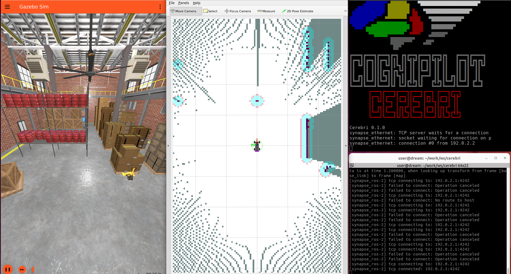

# Docker Install

## Setup Docker

[Docker Setup](https://github.com/CogniPilot/docker)

```bash
git clone git@github.com:CogniPilot/docker
cd docker/dream
docker compose run dream terminator
```
## Setup Helmet for MrBuggy3 SITL

```bash
cd ~/work
git clone git@github.com:CogniPilot/helmet
vcs import < helmet/dream/base.yaml
vcs import < helmet/dream/mrbuggy3.yaml 
```

## Build Cranium

```bash
cd ~/work/cranium
colcon build --symlink-install
. ./install.setup.sh
```

## Build Cerebri MrBuggy3 SITL

```bash
cd ~/work/ws/cerebri
west init -l .
west update
west build app/mrbuggy3/ -b native_posix -t install -p
```

## Run MrBuggy3 SITL

```bash
ros2 launch mrbuggy3_gz_bringup gz_nav2.launch.py
```

!!! attention
    **If running on a machine with a limited graphics card use:**
```bash
ros2 launch mrbuggy3_gz_bringup gz_nav2.launch.py world:=basic_map
```



