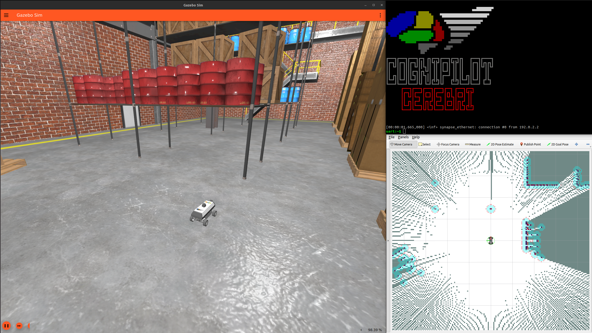

# Installation

## Requirements

* Ubuntu 22.04 host environment

This may work on other environments but only Ubuntu 22.04 is officially supported.

## Setup SSH keys on Host and GitHub

* Ensure that you have setup ssh keys on your host computer and GitHub to be able to clone the CogniPilot repositories: [Connecting to GitHub with SSH](https://docs.github.com/en/authentication/connecting-to-github-with-ssh)

## Setup GPG keys on Host and GitHub (Optional)

* Ensure that you have setup gpg keys on your host computer and GitHub to sign your commits: [Connecting to GitHub with SSH](https://docs.github.com/articles/generating-a-gpg-key/)

## Install Git

```bash
sudo apt install git
```

## Docker Option

If you wish, there is a [Docker Development Container](advanced/docker.md) that may be used.

## Clone Helmet

```bash
mkdir -p ~/cognipilot
cd ~/cognipilot
git clone git@github.com:cognipilot/helmet
```

## Run Install Script (If not using docker)

```bash
~/cognipilot/helmet/install/native_install.sh
. ~/.profile
```

## Convenience Scripts

### build\_b3rb\_SIL

```bash
build_b3rb_sil
```

This command executes the script [build\_b3rb\_SIL](https://github.com/CogniPilot/helmet/blob/77585804ac03f9911f52c6e9b3da7e4e363d1cf7/install/resources/build_b3rb_sil).

This script:

 * Sets up the vcs workspaces based on yaml files provided in helmet.
 * Builds the cranium ROS 2 workspace
 * Builds Cerebri native\_posix software-in-the-loop simuliation
 * Builds Cyecca (control/estimation software)
 * Builds Electrode (ground station software)

### docs

```bash
docs
```

This command executes the script [docs](https://github.com/CogniPilot/helmet/blob/77585804ac03f9911f52c6e9b3da7e4e363d1cf7/install/resources/docs).

This script:

* Downloads and builds the documentation repository for the documentation you are reading so that contributions can be made easily.


### cyecca

```bash
cyecca
```

This script:

* Starts a JupyterLab instance for Cyecca to aid in developing algorithms.


## Run B3RB SIL (in JupyterLab terminal or Bash directly)

```bash
ros2 launch b3rb_gz_bringup sil.launch.py
```

!!! attention
    **If running on a machine with a limited graphics card use:**
```bash
ros2 launch b3rb_gz_bringup sil.launch.py world:=basic_map
```

## Simulation

Example of simulation running.



!!! attention
    **Use a joystick controller ([Logitech F310](https://www.logitechg.com/en-us/products/gamepads/f310-gamepad.940-000110.html) suggested) to control vehicle modes.**

## Select a Mode:


* **A**: manual
* **X**: cmd_vel (nav2)
* **B**: auto (nav2)

### Manual Mode:

* **Left stick** Up/Down: throttle
* **Right stick** Left/Right: steering

### Nav2 (cmd_vel) Mode:

* Click **2D Pose Goal** and select desired location on RVIZ2 map.

### Auto Mode

* Click **2D Pose Goal** and select desired location on RVIZ2 map.

## Arming

* **START**: arm
* **BACK**: disarm

