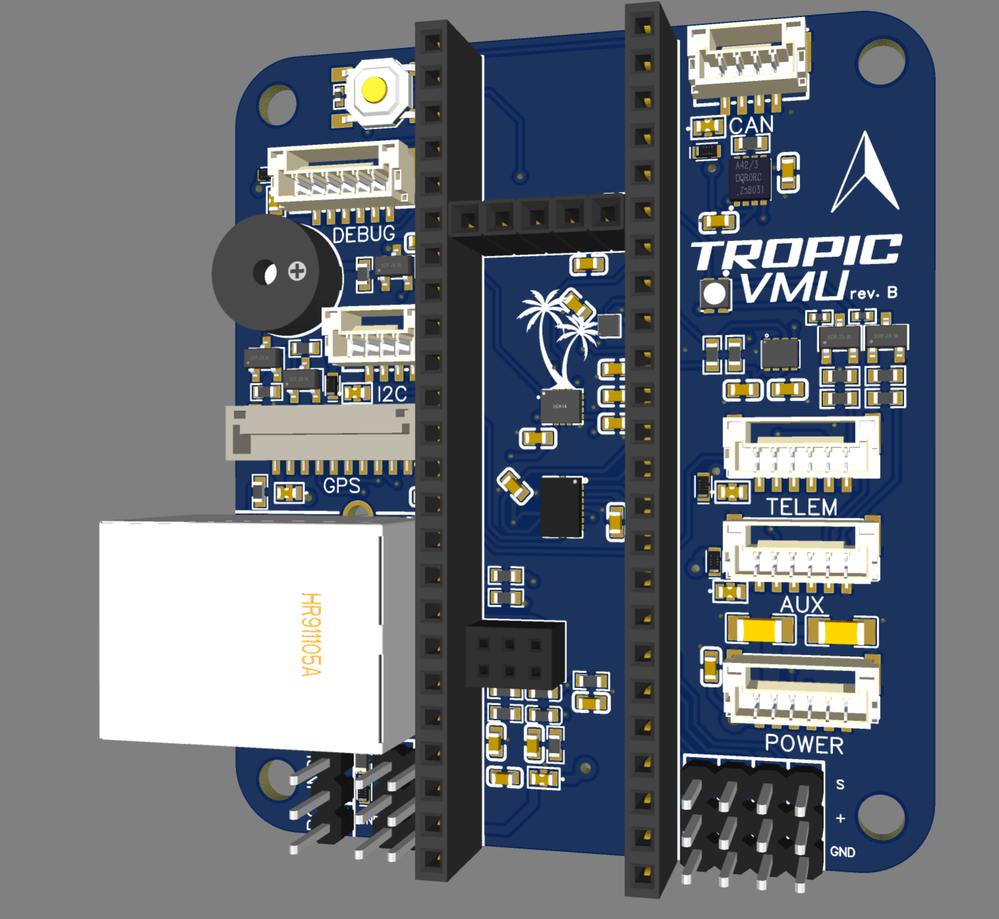

# Tropic

Tropic is a Vehicle Management Unit (VMU) designed around the [Teensy 4.1 Development board](https://www.pjrc.com/store/teensy41.html) and the Open-Source Tropic base board



# Hardware

Teensy 4.1 consisting of:

- NXP MIMXRT1062DVJ6B MCU
- Cortex-M7  600Mhz
- 1024K RAM (512 Tightly coupled)
- 8MB Flash
- 100Mbps Ethernet
- USB HS 480Mbit/s
- SD Card interface

Tropic Base board consisting of:

- TDK InvenSense ICM-42688-P IMU
- Bosch BMI088 IMU
- Bosch BMM150 Magnetometer 
- Infineon DPS310 Barometer
- NXP TJA1051TK CAN Tranceiver
- RGB Led
- Buzzer

With connectors for

- 10-pin JST-GH GPS connector
- 6-pin JST-GH UART + Handshake connector
- 6-pin JST-GH AUX Multi-function connector
    - UART
    - Quadrature decoder
    - PWM
    - Crossbar trigger
- 6-pin JST-GH Power module connector
    - [Holybro PM02](https://holybro.com/products/pm02-v3-12s-power-module)
    - [Aliexpress PM06](https://nl.aliexpress.com/item/1005003265592048.html?spm=a2g0o.productlist.main.57.5d7bUbAWUbAWRJ&algo_pvid=a921d23b-9f8c-424d-91c9-7d8407cadea6&algo_exp_id=a921d23b-9f8c-424d-91c9-7d8407cadea6-28&pdp_npi=4%40dis%21EUR%2113.96%219.78%21%21%2114.68%2110.28%21%402103896117081946544951477ef06f%2112000024928023880%21sea%21NL%21919188679%21&curPageLogUid=gQjCeaENMPHX&utparam-url=scene%3Asearch%7Cquery_from%3A)
- 6-pin JST-GH Debug UART connector providing system console
- 4-pin JST-GH I2C connector
- 4-pin JST-GH CAN bus connector
- 3-pin DuPont for Digital Receiver i.e. SBUS
- 6x 3-pin DuPont PWM header

Powering the board

The Tropic VMU can be powered in 2 ways

!!! warning
    You should only power through either methods for example current can flow from the power module to your usb potentially damaging your machine.
    You could cut the power pad on the Teensy as a precaution if you want to use USB and a Power-module simultaneously, but by doing so you would lose the ability to power the board through USB.
    For more information see [Teensy External Power](https://www.pjrc.com/teensy/external_power.html) guide.

1. Through the micro-USB port on the Teensy 4.1
2. Through a 6-pin JST-GH power module

If Cognipilot has been succesfully flash you should hear a startup tone.

Flashing the board

The Teensy comes with it's own bootloader, allowing to flash Cerebri through USB.
Teensy provides a Teensy Loader gui flashing for more information checkout their [guide](https://www.pjrc.com/teensy/loader.html)

On Linux you can also flash Cerebri directly from the `west` build system.
First you've to make sure to install the `teensy-loader-cli` application.
On a Ubuntu based system you can use the following command

```sudo apt install teensy-loader-cli```

Connect the board through USB and then press the physical button on the Teensy to put it into bootloader mode.

Flashing the board is simply done by the command below

```west flash```

On success you should get the following output

```
-- west flash: rebuilding
[1/1] cd /home/peter/cognipilot/ws/cerebri/build/zephyr &&...=/home/peter/cognipilot/ws/cerebri/build/zephyr/zephyr.elf
/home/peter/cognipilot/ws/cerebri/build/zephyr/runners.yaml
flash-runner
-- west flash: using runner teensy
-- runners.teensy: Flashing file: /home/peter/cognipilot/ws/cerebri/build/zephyr/zephyr.hex
```

Serial Console 

By default the Cerebri Serial console is provided through `lpuart` on the 6-pin JST-GH connector labeled Debug.
```
                                          ▄▄▄▄▄▄▄▄
         ▄▄▄▄▄ ▄▄▄▄▄                    ▀▀▀▀▀▀▀▀▀
     ▄███████▀▄██████▄   ▀█████████████████████▀
  ▄██████████ ████████ ▄   ▄▄▄▄▄▄▄▄▄▄▄▄▄▄▄▄▄▄
 ███████████▀ ███████▀ ██   ▀▀▀▀▀▀▀▀▀▀▀▀▀▀▀▀
█████████▀   ▀▀▀▀▀▀▀▀ ████   ▀███████████▀
▀█████▀ ▄▄███████████▄ ████   ▄▄▄▄▄▄▄▄▄
  ▀▀▀ ███████████████▀ ████   ▀▀▀▀▀▀▀▀
       ▀▀█████▀▀▀▀▀▀  ▀▀▀▀   ▄█████▀
               ████████▀    ▄▄▄
               ▀███▀       ▀▀▀
                ▀▀
╔═══╗╔═══╗╔═══╗╔═╗ ╔╗╔══╗╔═══╗╔══╗╔╗   ╔═══╗╔════╗
║╔═╗║║╔═╗║║╔═╗║║║║ ║║╚╣╠╝║╔═╗║╚╣╠╝║║   ║╔═╗║║╔╗╔╗║
║║ ╚╝║║ ║║║║ ╚╝║║╚╗║║ ║║ ║║ ║║ ║║ ║║   ║║ ║║╚╝║║╚╝
║║   ║║ ║║║║╔═╗║╔╗╚╝║ ║║ ║╚═╝║ ║║ ║║   ║║ ║║  ║║
║║ ╔╗║║ ║║║║╚╗║║║╚╗║║ ║║ ║╔══╝ ║║ ║║ ╔╗║║ ║║  ║║
║╚═╝║║╚═╝║║╚═╝║║║ ║║║╔╣╠╗║║   ╔╣╠╗║╚═╝║║╚═╝║ ╔╝╚╗
╚═══╝╚═══╝╚═══╝╚╝ ╚═╝╚══╝╚╝   ╚══╝╚═══╝╚═══╝ ╚══╝
       ┏━━━┓┏━━━┓┏━━━┓┏━━━┓┏━━┓ ┏━━━┓┏━━┓
       ┃┏━┓┃┃┏━━┛┃┏━┓┃┃┏━━┛┃┏┓┃ ┃┏━┓┃┗┫┣┛
       ┃┃ ┗┛┃┗━┓ ┃┗━┛┃┃┗━┓ ┃┗┛┗┓┃┗━┛┃ ┃┃
       ┃┃ ┏┓┃┏━┛ ┃┏┓┏┛┃┏━┛ ┃┏━┓┃┃┏┓┏┛ ┃┃
       ┃┗━┛┃┃┗━━┓┃┃┃┗┓┃┗━━┓┃┗━┛┃┃┃┃┗┓┏┫┣┓
       ┗━━━┛┗━━━┛┗┛┗━┛┗━━━┛┗━━━┛┗┛┗━┛┗━━┛
*** Booting Zephyr OS build zephyr-v3.5.0-3936-g9e01bfe86b7c ***
uart:~$
```
On bootup you should see this Cognipilot banner and then you get a `uart:~$` shell to type your commands